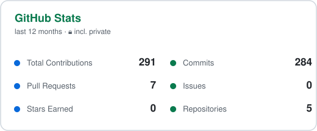
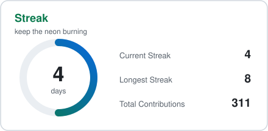
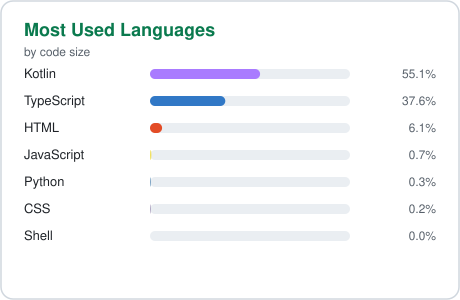
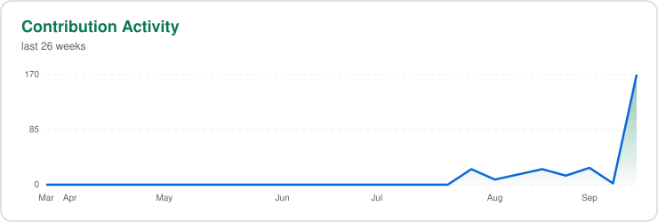

<div align="center">

<picture>
  <source media="(prefers-color-scheme: dark)" srcset="assets/header-dark.svg" />
  
</picture>

<a href="https://github.com/NeonBhoot">
  
</a>

<p><i>Ship fast, break nothing, look neon doing it.</i> 👻</p>


</div>

---

## 🧑‍💻 About — as code

```kotlin
val takbir = Developer(
    name = "Takbir A. Himu",
    role = "Android Developer",
    base = "Kishoreganj, Bangladesh",
    stack = listOf("Kotlin", "Jetpack Compose", "Firebase", "Next.js"),
    shipping = listOf("BeHisabi", "Admin Panel", "takbirhimu.me"),
    interests = listOf("clean architecture", "offline-first apps", "apps in Bangla"),
    funFact = "Bike + music + মাঝে মাঝে হিমু মুড 🏍️"
)
```

## 🛠️ Tech stack

<div align="center">
  
</div>

## 📊 Stats

<div align="center">
  <picture>
    <source media="(prefers-color-scheme: dark)" srcset="assets/stats-dark.svg" />
    
  </picture>
  <picture>
    <source media="(prefers-color-scheme: dark)" srcset="assets/streak-dark.svg" />
    
  </picture>
</div>

<div align="center">
  <picture>
    <source media="(prefers-color-scheme: dark)" srcset="assets/top-langs-dark.svg" />
    
  </picture>
</div>

<div align="center">
  <picture>
    <source media="(prefers-color-scheme: dark)" srcset="assets/activity-dark.svg" />
    
  </picture>
</div>

## 🐍 Contribution snake

<div align="center">
  <picture>
    <source media="(prefers-color-scheme: dark)" srcset="assets/github-contribution-grid-snake-dark.svg" />
    <source media="(prefers-color-scheme: light)" srcset="assets/github-contribution-grid-snake.svg" />
    
  </picture>
</div>

## ✍️ Latest from the blog

<div align="center">

<!-- BLOG-POST-LIST:START --><p align="center"><a href="https://takbirhimu.me/blog/err-require-esm-firebase-admin-v14-vercel-fix"></a><br/>📝 <b><a href="https://takbirhimu.me/blog/err-require-esm-firebase-admin-v14-vercel-fix">ERR_REQUIRE_ESM: Fixing the firebase-admin v14 Crash on Vercel</a></b><br/><sub>📅 Sep 24, 2026</sub></p>
<!-- BLOG-POST-LIST:END -->

<a href="https://takbirhimu.me/blog"></a>

</div>

## 🤝 Connect

<div align="center">

[](https://takbirhimu.me)
[](https://x.com/heytakbir)


<br/>

<i>"হিমুর মতো — মাঝে মাঝে যুক্তির বাইরে একটু হেঁটে দেখি, কোড কোথায় নিয়ে যায়।"</i>

</div>

<picture>
  <source media="(prefers-color-scheme: dark)" srcset="assets/footer-dark.svg" />
  
</picture>
